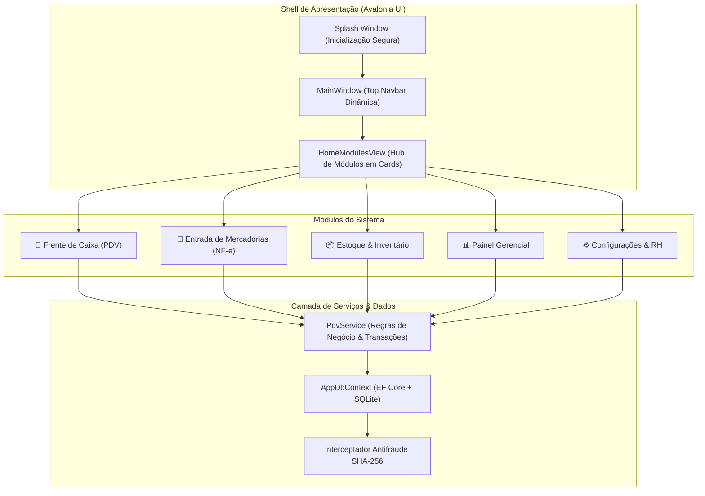
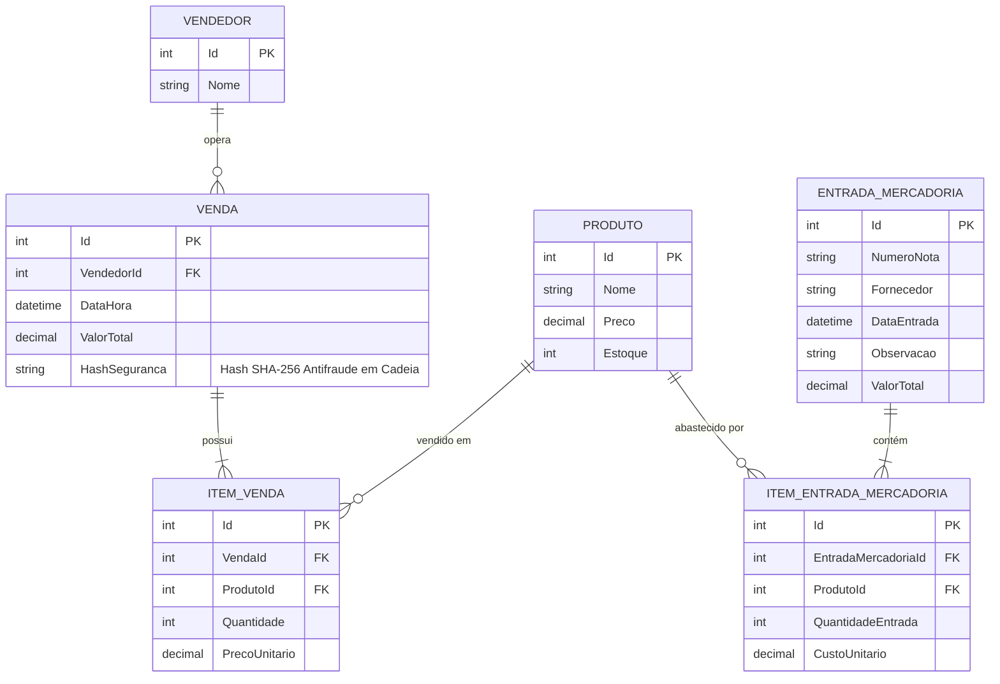
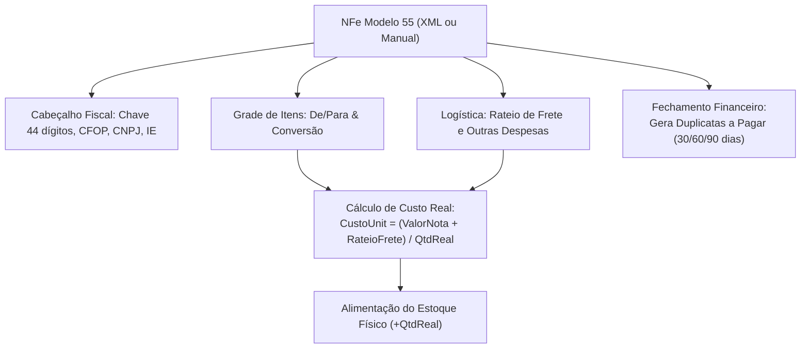

# COMERCIAL PRO ERP — DOCUMENTAÇÃO TÉCNICA E OPERACIONAL DO SISTEMA

> **Versão:** 1.3.0 (Homologado com 208 Testes Unitários)  
> **Framework:** .NET 10 (C# 14)  
> **UI Toolkit:** Avalonia UI 11.2 (Cross-Platform / Linux Wayland & X11 / Windows)  
> **Persistência:** Entity Framework Core 9 / SQLite com Integridade Transacional  
> **Padrão de Arquitetura:** MVVM (Model-View-ViewModel) com Inversão de Controle (IoC) e Tunnel Event Routing  

---

## 1. VISÃO GERAL E FILOSOFIA DE ENGENHARIA

O **Comercial Pro ERP** é um ecossistema modular para varejo e atacado desenhado com foco em **três pilares críticos**:
1. **Velocidade de Memória Muscular no Caixa (Zero Mouse):** Operadores de PDV não devem usar mouse. A interface responde a atalhos físicos e multiplicadores inline com processamento em tempo real.
2. **Conformidade Fiscal & Formação de Custo Real:** Módulo de Entrada de NF-e Master-Detail com De/Para, Fator de Conversão de volumes e rateio logístico.
3. **Integridade de Dados & Auditoria Antifraude:** Assinatura em cadeia (blockchain fiscal local em SHA-256) gravada em SQLite em nível de transação.



---

## 2. ARQUITETURA DE DIRETÓRIOS DO PROJETO

```
GetStartedApp/
├── Data/
│   └── AppDbContext.cs            # Contexto EF Core, configuração SQLite e Blockchain SHA-256
├── Models/
│   └── Entities.cs                # Entidades: Produto, Venda, ItemVenda, Vendedor, EntradaMercadoria...
├── Services/
│   └── PdvService.cs              # Camada transacional de negócios, cálculo de giro e inventário
├── ViewModels/
│   ├── ViewModelBase.cs           # Classe base herdada de CommunityToolkit ObservableObject
│   ├── MainViewModel.cs           # Orquestrador de navegação global e controle de Navbar
│   ├── HomeModulesViewModel.cs    # Hub de inicialização de módulos
│   ├── PdvViewModel.cs            # Máquina de estados do PDV, multiplicadores e pagamentos
│   ├── EntradaNfeViewModel.cs     # Master-Detail fiscal, De/Para, Custos e Contas a Pagar
│   ├── EstoqueViewModel.cs        # Catálogo, precificação e fechamento físico diário
│   ├── DashboardViewModel.cs      # Métricas e KPIs de faturamento
│   └── ConfiguracoesViewModel.cs  # Operadores, periféricos e segurança
├── Views/
│   ├── SplashWindow.axaml(.cs)    # Splash de carregamento e auto-migração de BD
│   ├── MainWindow.axaml(.cs)      # Janela principal e barra de navegação superior
│   ├── HomeModulesView.axaml(.cs) # Tela com cards de inicialização dos aplicativos
│   ├── PdvView.axaml(.cs)         # Frente de caixa com Tunneling e isolamento modal
│   ├── EntradaNfeView.axaml(.cs)  # Tela corporativa de entrada fiscal e custos
│   ├── EstoqueView.axaml(.cs)     # Abas de catálogo e auditoria física
│   ├── DashboardView.axaml(.cs)   # Telas gráficas de desempenho
│   └── ConfiguracoesView.axaml(.cs)# Gestão de equipe e simulação de hardware
├── Migrations/                    # Histórico de esquemas e migrações do banco
├── logs/                          # Logs rotativos diários via Serilog (pdv_log_*.txt)
├── Program.cs                     # Ponto de entrada do runtime Avalonia
└── App.axaml(.cs)                 # Inicializador IoC/DI e injeção de dependências
```

---

## 3. MODELAGEM DE BANCO DE DADOS & ESQUEMA RELACIONAL

O banco de dados é mantido no arquivo local `pdv.db` através do **SQLite** gerenciado pelo Entity Framework Core com transações atômicas (`BeginTransactionAsync`).



### Protocolo Antifraude em Nível de Linha (Blockchain Local)
Implementado em [AppDbContext.cs](file:///home/tomate/Lixeira/dotnet/C#/GetStartedApp/Data/AppDbContext.cs):
1. Antes de persistir qualquer venda, o `ChangeTracker` intercepta as entidades com estado `EntityState.Added`.
2. O sistema consulta o último registro anterior para obter seu `HashSeguranca`. Se não houver, adota a chave semente `"BLOCO_GENESIS_00000000"`.
3. Monta a string canônica de assinatura:
   $$\text{Assinatura} = \text{SHA256}(\text{HashAnterior} \parallel \text{DataHora ISO} \parallel \text{ValorTotal} \parallel \text{VendedorId})$$
4. Essa assinatura é gravada de forma indelével. Se um invasor alterar manualmente o valor de uma venda no banco de dados SQLite, toda a cadeia subsequente torna-se matematicamente inválida na verificação de auditoria.

---

## 4. GUIA DE MÓDULOS & REGRAS DE NEGÓCIO

### 4.1 Frente de Caixa (PDV) — Mecânica de Teclado & Foco
Localização: [PdvView.axaml](file:///home/tomate/Lixeira/dotnet/C#/GetStartedApp/Views/PdvView.axaml) e [PdvViewModel.cs](file:///home/tomate/Lixeira/dotnet/C#/GetStartedApp/ViewModels/PdvViewModel.cs).

#### 1. Sistema de Multiplicador Inline
O operador nunca precisa clicar no mouse ou dar tab para alterar quantidade:
- Digitar `sacol` + `[ENTER]` $\rightarrow$ Lança **1 unidade** do primeiro resultado.
- Digitar `5*sacol` ou `12*copo` + `[ENTER]` $\rightarrow$ O parser separa o multiplicador através de regex/split, busca o termo e lança **5 unidades** diretamente no cupom fiscal.

#### 2. Navegação com Setas [↓ / ↑]
- Ao digitar um nome parcial (ex: `copo`), o catálogo filtra os itens em tempo real na lista flutuante.
- Pressionar as teclas de seta para baixo (`Down`) ou para cima (`Up`) movimenta `ProdutoPesquisaSelecionado` sem roubar o foco do cursor de texto.
- Pressionar `[ENTER]` confirma o item que estiver destacado.

#### 3. Ciclo de Isolamento do Modal de Pagamento (Anti-Focus Leak)
Para evitar que toques de mouse ou teclas vazem para a venda que está embaixo:
- O Grid principal recebe `IsEnabled="{Binding !IsModalAberto}"`. Todos os controles de fundo ficam visualmente e funcionalmente desativados.
- O container do modal recebe `KeyboardNavigation.TabNavigation="Cycle"`, confinando a navegação por `Tab` estritamente dentro da janela de fechamento.
- **[ESC]:** Cancela o fechamento sem alterar o carrinho e devolve imediatamente o foco para o campo de pesquisa.
- **[ENTER]:** No campo `TxtCliente`, pula o cursor diretamente para o `NumValorRecebido`. No campo de valor, confirma a venda e finaliza o cupom.

#### 4. Mapa de Atalhos Físicos
| Tecla | Escopo | Ação Executada |
| :--- | :--- | :--- |
| `[ENTER] / [Return]` | Busca PDV | Lança produto no cupom (respeitando `Qtd*Item`) |
| `[↓] / [↑]` | Busca PDV | Seleciona variação na lista de sugestões |
| `[F2]` | Global PDV | Força foco imediato na caixa de busca de produto |
| `[F8]` | Global PDV | Remove / Cancela o item selecionado no cupom |
| `[F12]` | Global PDV | Abre o Modal de Pagamento e Fechamento |
| `[ESC]` | Busca PDV | Se houver texto, limpa a caixa. Se vazio, limpa todo o cupom |
| `[ESC]` | Modal Aberto| Fecha o modal mantendo a venda 100% intacta |
| `[ENTER]` | Modal Aberto| Avança campos ou confirma o recebimento se valor for válido |

---

### 4.2 Módulo Fiscal: Entrada de NF-e & Suprimentos
Localização: [EntradaNfeView.axaml](file:///home/tomate/Lixeira/dotnet/C#/GetStartedApp/Views/EntradaNfeView.axaml) e [EntradaNfeViewModel.cs](file:///home/tomate/Lixeira/dotnet/C#/GetStartedApp/ViewModels/EntradaNfeViewModel.cs).

O módulo trata a entrada como um documento fiscal corporativo (Master-Detail):



#### Regras de Conversão e Custo:
- **Fator de Conversão ($F_c$):** Se a nota fiscal traz 10 fardos (`FD`) ou caixas (`CX`) e cada caixa possui 12 garrafas/unidades, define-se $F_c = 12$. A quantidade real que dá entrada no estoque é:
  $$Q_{\text{estoque}} = Q_{\text{faturada}} \times F_c$$
- **Rateio de Despesas Logísticas:** O frete e outras despesas são rateados proporcionalmente entre os itens da nota. O **Custo Unitário Real de Entrada** é calculado por:
  $$\text{Custo Real Unitário} = \frac{\text{Total Faturado do Item} + \text{Rateio de Frete/Despesas}}{Q_{\text{estoque}}}$$
- **Vínculo De/Para:** Cada linha da nota pode ser mapeada para um produto existente no catálogo do ERP via ComboBox de busca.

---

### 4.3 Gestão de Estoque & Fechamento Físico
Localização: [EstoqueView.axaml](file:///home/tomate/Lixeira/dotnet/C#/GetStartedApp/Views/EstoqueView.axaml) e [EstoqueViewModel.cs](file:///home/tomate/Lixeira/dotnet/C#/GetStartedApp/ViewModels/EstoqueViewModel.cs).

1. **Aba Catálogo & Precificação:** Visualização em tabela com badges de alerta de estoque, alteração de preço de venda e cadastro rápido.
2. **Aba Fechamento Físico (Giro do Dia):** Ferramenta de auditoria física. O operador filtra uma data (ex: hoje) e o sistema gera o balanço:
   - Quantidade vendida no período (extraída de `ItensVenda`).
   - Quantidade atual em sistema.
   - Coluna de conferência física (linha para anotação e conferência de quebras/perdas).

---


---

### 4.4 Tríade Crítica de Produção (REV-002)

#### 4.4.1 Cancelamento Oficial de NFC-e (Evento 110111)
- **Serviço:** [NfceCancelamentoService.cs](file:///home/tomate/Lixeira/dotnet/C#/GetStartedApp/Services/Fiscal/NfceCancelamentoService.cs) / [INfceCancelamentoService.cs](file:///home/tomate/Lixeira/dotnet/C#/GetStartedApp/Services/Fiscal/INfceCancelamentoService.cs)
- **Regras:**
  - Justificativa mínima de 15 caracteres (exigência SEFAZ).
  - Senha de supervisor (`1234` ou `admin`) obrigatória para prevenir fraudes.
  - Janela de cancelamento de até 30 minutos a partir da emissão (Rejeição 220).
  - Reincorporação automática e atômica ao estoque físico via `AjustesEstoque` (`TipoAjuste = "ENTRADA_AVULSA"`).
  - Abatimento correspondente no turno de caixa ativo (`CaixaTurno`).
  - Interface do PDV equipada com atalho `[F7]` e modal flutuante com bloqueio de eventos em segundo plano.

#### 4.4.2 Fechamento Fiscal Mensal (.ZIP Contábil)
- **Serviço:** [FechamentoFiscalService.cs](file:///home/tomate/Lixeira/dotnet/C#/GetStartedApp/Services/Fiscal/FechamentoFiscalService.cs) / [IFechamentoFiscalService.cs](file:///home/tomate/Lixeira/dotnet/C#/GetStartedApp/Services/Fiscal/IFechamentoFiscalService.cs)
- **Regras:**
  - Varredura de vendas autorizadas e canceladas de um determinado mês e ano.
  - Empacotamento em `FechamentoFiscal_[CNPJ]_[ANO]_[MES].zip`.
  - Estrutura de pastas padronizada: `Autorizadas/` (XMLs nfeProc), `Canceladas/` (XMLs procEventoNFe) e `Resumo_Fiscal_AAAA_MM.csv`.
  - Exportação e integração direta na aba "Fechamento Fiscal" em Configurações.

#### 4.4.3 Backup Resiliente do Banco SQLite (`pdv.db`)
- **Serviço:** [BackupDatabaseService.cs](file:///home/tomate/Lixeira/dotnet/C#/GetStartedApp/Services/BackupDatabaseService.cs) / [IBackupDatabaseService.cs](file:///home/tomate/Lixeira/dotnet/C#/GetStartedApp/Services/IBackupDatabaseService.cs)
- **Regras:**
  - Snapshot seguro em runtime usando `VACUUM INTO` (sem bloquear leituras/escritas concorrentes em modo WAL).
  - Compactação automática em arquivo ZIP nomeado com timestamp (`pdv_backup_yyyyMMdd_HHmmss.zip`).
  - Retenção programada com expurgo automático de arquivos com mais de 30 dias (mantendo no mínimo 5 backups).
  - Disparo automático integrado no Fechamento de Caixa (`PdvService.Caixa.cs`).
  - Restauração assistida na aba "Backup do Sistema" em Configurações.

## 5. CICLO DE VIDA DO BANCO DE DADOS & MIGRAÇÕES

### 5.1 Regras de Migração (EF Core)
Sempre que uma nova propriedade ou entidade for adicionada em `Models/Entities.cs`:
1. Adicionar o `DbSet<T>` correspondente em [AppDbContext.cs](file:///home/tomate/Lixeira/dotnet/C#/GetStartedApp/Data/AppDbContext.cs).
2. Criar a migration formal no terminal:
   ```bash
   dotnet ef migrations add NomeDaAlteracao
   ```
3. Aplicar as alterações no banco de dados local:
   ```bash
   dotnet ef database update
   ```

### 5.2 Supressão Segura de Avisos em Desenvolvimento
Para evitar exceções de `PendingModelChangesWarning` que bloqueiem a Splash Screen antes da geração manual da migration, o contexto está protegido com:
```csharp
optionsBuilder.ConfigureWarnings(w => w.Ignore(RelationalEventId.PendingModelChangesWarning));
```

---

## 6. GUIA OPERACIONAL DO DESENVOLVEDOR (RUNBOOK)

### 6.1 Compilação e Execução
```bash
# Restaurar dependências e verificar integridade
dotnet restore

# Compilar projeto (garantir 0 avisos e 0 erros)
dotnet build

# Executar a aplicação
dotnet run
```

### 6.2 Análise de Logs e Diagnóstico
Todos os eventos de inicialização, consultas de PDV, comandos de teclado capturados e transações fiscais são gravados em tempo real na pasta `logs/`:
```bash
# Acompanhar logs em tempo real durante testes de interface
tail -f logs/pdv_log_*.txt
```

### 6.3 Boas Práticas de UI em Avalonia
- **Contêineres e Padding:** Elementos `<Grid>` não aceitam a propriedade `Padding`. Para adicionar espaçamento interno a uma grade, envolva-a em um `<Border Padding="...">`.
- **Watermark Obsoleto:** Em versões recentes do Avalonia, utilizar `PlaceholderText="..."` em vez de `Watermark="..."`.
- **Captura de Teclas:** Para teclas interceptadas antes dos controles filhos (como `Enter` em `TextBox`), utilize sempre a estratégia de túnel:
  ```csharp
  this.AddHandler(InputElement.KeyDownEvent, Handler_KeyDownTunnel, RoutingStrategies.Tunnel);
  ```

---

*Documentação mantida pela equipe de engenharia do Comercial Pro ERP.*
